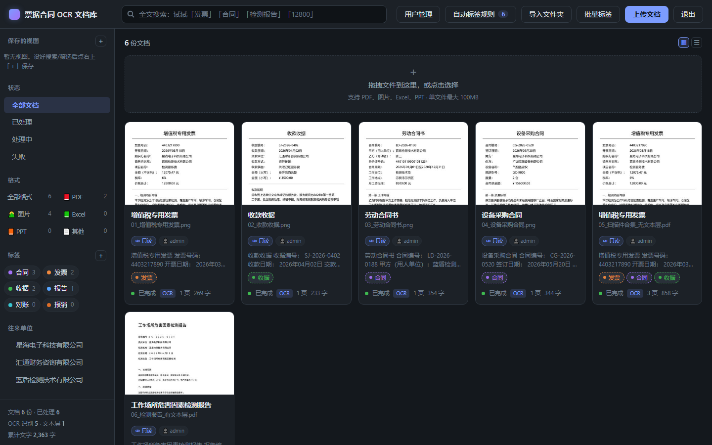
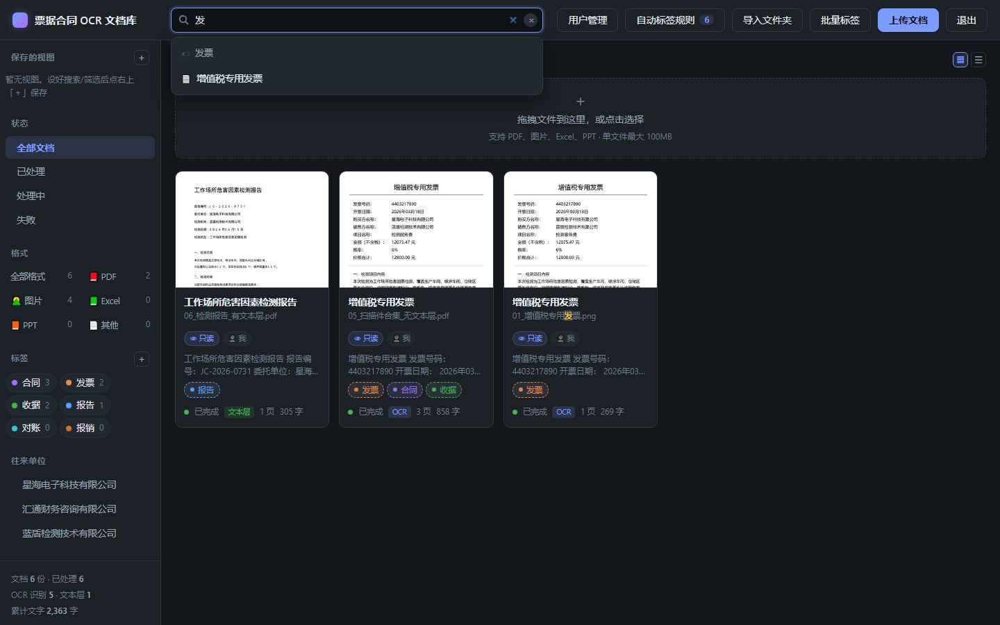
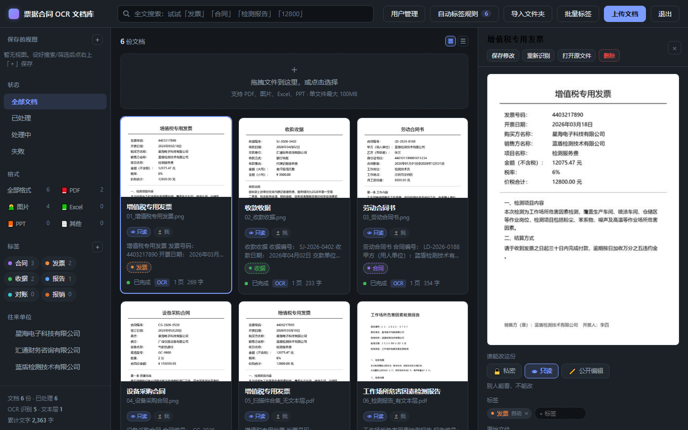
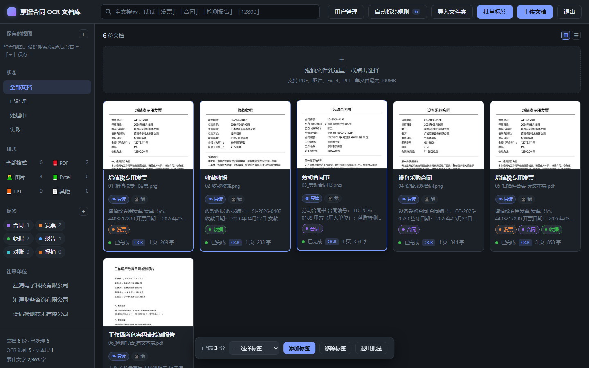
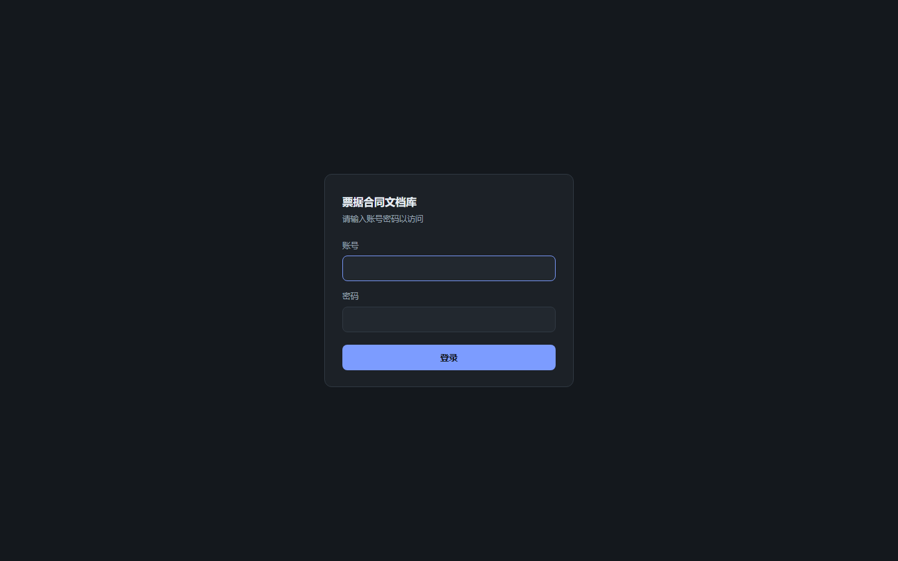
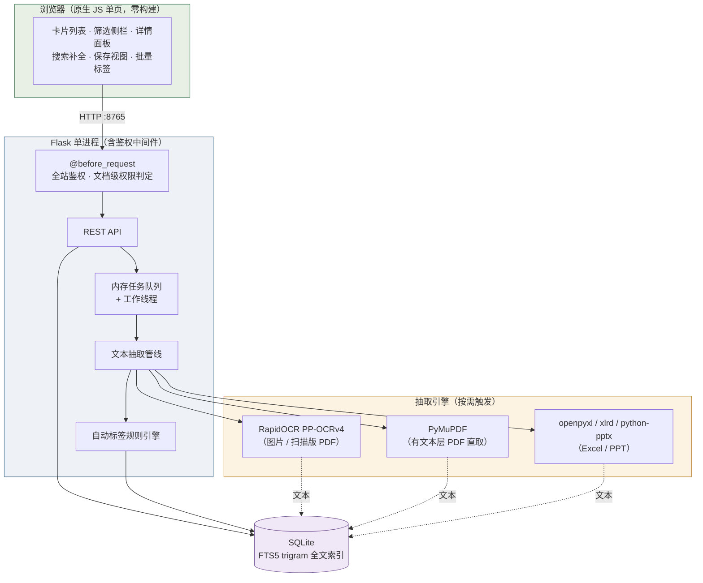

<div align="center">

# paperless-lite

**一个能在老电脑上跑起来的中文票据 / 合同 / 报告 OCR 文档库**
*Self-hosted OCR document archive with first-class Chinese support — runs on ancient hardware, zero external services.*

[](#快速开始)
[](https://www.python.org/)
[](https://flask.palletsprojects.com/)
[](https://www.sqlite.org/fts5.html)
[](#技术栈)
[](#核心优势)
[](LICENSE)
[](https://github.com/FaN648512/paperless-lite/pulls)

</div>

---

<div align="center">

**[项目简介](#项目简介)** ·
**[核心优势](#核心优势)** ·
**[功能特性](#功能特性)** ·
**[界面预览](#界面预览)** ·
**[UI 设计理念](#ui-设计理念)** ·
**[快速开始](#快速开始)** ·
**[工作原理](#工作原理)** ·
**[常见问题](#常见问题)** ·
**[路线图](#路线图)**

</div>

---

## 项目简介

paperless-lite 是把**纸质票据、合同、检测报告、台账表格**变成「可搜索、可打标签、可分权限」的本地文档库。

它诞生于一个很具体的约束：手头只有一台 **2011 年的老机器（双核 / 3.9 GB 内存 / 无虚拟化 / CPU 不支持 AVX2）**，而 paperless-ngx 这类完整方案依赖 Docker + Tesseract + Postgres + Redis 多组件，在这台机器上根本起不来。

于是选择「保真降级」而不是「放弃」：**拆掉所有重组件，保留全部核心玩法**——

```
上传（图片 / PDF / Excel / PPT） → OCR 文本提取 → 标签（含自动规则引擎） → 中文全文搜索 → 多用户权限
```

整个系统是 **单进程 Flask 应用**，不依赖任何外部服务，数据全部落在本地磁盘，**不联网、不上传、不调用第三方 API**。

> 适合：个人 / 小团队整理票据合同、行政归档、财务资料管理；
> 也适合：想在低配机器或离线环境里体验「文档数字化」这件事的开发者。

---

## 核心优势

| 痛点 | 常见方案的状况 | paperless-lite 的做法 |
|---|---|---|
| **中文票据识别差** | 多数开源方案默认 Tesseract，中文需另装 `chi_sim` 语言包，票据排版下错字多 | 用 **RapidOCR（PP-OCRv4）**，中文识别显著更稳；纯 pip 安装，**无需任何系统级二进制** |
| **部署太重** | Docker Compose 拉起 5+ 容器，内存起步 2 GB，老机器/Windows 直接劝退 | **单进程** Flask + SQLite，无 Redis / 无 Celery / 无 Postgres，`pip install` 后 `python app.py` 即用 |
| **老硬件跑不动** | 新版 OCR 推理库需要 AVX2 指令集，2011 年前后的 CPU 一跑就崩 | 实测锁定 `onnxruntime==1.20.1`，**在无 AVX2 的老 CPU 上稳定运行**（见 [常见问题](#常见问题)） |
| **中文搜不出来** | 通用全文检索引擎对中文分词不友好，两字词（"发票""合同"）常搜不到 | **FTS5 `trigram` 主路径 + `LIKE` 兜底**，三字及以上走索引，两字词自动回退，结果合并去重 |
| **文件混在一起没人管** | 多人共用时"谁传的""谁能改"全靠自觉 | **多用户 + 文档归属 + 三态可见性**（私密 / 只读 / 公开编辑），权限到单文档级 |
| **数据在别人服务器上** | SaaS 类工具要把合同发票传给第三方 | **100% 本地**：数据目录在你自己的磁盘上，可一键备份，可整目录搬走 |

---

## 功能特性

### 📥 导入

- **多格式**：图片（png / jpg / bmp / tif / webp）、PDF、Excel（xlsx / xlsm / xls）、PowerPoint（pptx / ppt）
- **双分支文本抽取**：有文本层的 PDF **直取文本**（快一个数量级），扫描件才走 OCR
- **拖拽 / 点击上传**，带实时进度与「处理中」状态
- **文件夹批量导入**：输入路径 → 扫描清单（可勾选删改）→ 确认导入
- **MD5 查重**：重复文件只保留一份，并明确提示跳过了哪些

### 🏷 组织

- **标签**：新建、删除、多色、绑定自动规则
- **自动标签规则引擎**：`any`（空格分词 OR）/ `all`（AND）/ `regex`（正则）/ `fulltext`（检索式）× 字段（标题 / 正文 / 往来方）
- **新建标签即全库匹配**：历史文档自动补上符合条件的新标签
- **批量标签**：多选卡片统一加/移除标签（越权文档自动跳过并提示）
- **格式分类**：左侧栏按 PDF / 图片 / Excel / PPT 分组筛选，实时计数

### 🔍 检索

- **中文全文搜索**：trigram 索引 + 短词回退，命中结果高亮
- **搜索自动补全**：输入即浮出「标签」与「文档标题」候选（私密文档只对本人/管理员出现）
- **可保存筛选视图**：搜索词 + 标签 + 状态的组合一键存取
- **多维筛选**：标签 / 文档类型 / 往来方 / 格式 / 状态

### 🔐 权限与安全

- **首次访问强制设置密码**，不存在"零鉴权裸奔"窗口期
- **密码哈希存储**（werkzeug scrypt），账号文件与本机数据同处数据目录
- **多用户 + 角色**：首个账号为管理员，可在「用户管理」增删账号
- **文档可见性三态**：

| 状态 | 别人能看 | 别人能改 | 典型用途 |
|---|---|---|---|
| 🔒 私密 | ❌ | ❌ | 工资单、个人合同 |
| 👁 只读（默认） | ✅ | ❌ | 制度文件、对外资料 |
| ✏️ 公开编辑 | ✅ | ✅ | 协作整理的项目资料 |

- **防爆破**：外部 IP 连续 5 次错误锁 5 分钟；**本机（127.0.0.1）豁免**，避免"自己把自己锁在门外"
- **局域网共享开关**：一键放行 / 关闭 Windows 防火墙端口（限专用/域网络），并附排查清单

### 🛠 运维

- **一键备份**：SQLite 官方 backup 接口做一致性快照（服务运行中也安全），按时间戳存放、自动保留最近 5 份，备份目录内附「恢复方法.txt」
- **服务守护**：崩溃自动重启
- **数据可迁移**：整目录拷走即完成迁移

---

## 界面预览

> 以下截图取自本项目自带样例（**程序生成的虚构素材**：虚构公司与人名），可直接复现：`python tools/make_samples.py` 生成素材 → 导入即可。

**文档库总览** —— 左侧筛选栏（保存的视图 / 状态 / 格式 / 标签 / 往来方），中间卡片列表带缩略图、标签与处理状态



**搜索自动补全** —— 输入即浮出「标签」与「文档标题」候选，点标签候选可直接切换为标签筛选



**文档详情面板** —— 左侧原件预览 + 右侧可编辑元数据；底部「谁能改这份」即三态可见性开关（私密 / 只读 / 公开编辑）



**批量标签** —— 批量模式下多选卡片，统一加/移除标签（无编辑权限的文档会自动跳过并提示）



**登录页** —— 首次访问强制设置账号密码，之后为登录/改密



---

## UI 设计理念

界面刻意保持**零构建链**（原生 JS + 一个 CSS 文件），既是老机器上的性能选择，也是设计取向：

| 设计点 | 做法 | 为什么 |
|---|---|---|
| **深色操作界面** | 深灰底 + 卡片式列表，缩略图与状态色自然"跳"出来 | 高频筛选场景下降低视觉疲劳，长时间看不刺眼 |
| **三栏布局** | 左侧筛选栏 / 中间卡片列表 / 右侧详情面板 | 筛选、浏览、编辑互不打断；详情面板打开时列表自动收窄 |
| **详情面板固定顶栏** | 顶栏 `sticky`，「保存 / 重新识别 / 打开原件 / 删除」常驻，关闭键水平垂直居中 | 长文档滚动时不丢操作入口 |
| **即时反馈** | 悬停态、处理中状态、Toast 提示、空结果弹窗 | 任何操作都有明确回应，消除"是不是卡住了"的焦虑 |
| **颜色即语义** | 状态、标签、格式各有一套稳定配色 | 扫读时靠颜色定位，不依赖读文字 |
| **护眼绿文档页** | 说明/教程类 HTML 用中低明度豆沙绿（`#cfe6cd`），正文对比度 8.9:1（超过 WCAG AA 的 4.5:1） | 应用界面求"清楚"，阅读文档求"不累"——两者刻意分开 |

> 设计原则：**颜色全部收进 `:root` CSS 变量**，换肤只改变量；**不为了好看牺牲信息密度**。

---

## 快速开始

### 环境要求

| 项 | 最低 | 建议 |
|---|---|---|
| Python | 3.10 | 3.12 / 3.13 |
| 内存 | 2 GB | 4 GB+（OCR 单页峰值约 1 GB） |
| CPU | 双核 | 四核（OCR 速度翻倍） |
| 磁盘 | 2 GB | 视文档量；SSD 明显更快 |

> 操作系统：Windows / Linux / macOS 均可（纯 Python 栈，无系统级依赖）。
> Windows 上的 `启动服务.pyw` / `局域网共享.py` / `备份数据.pyw` 等辅助脚本为可选增强。

### 三步跑起来

```bash
# 1. 安装依赖
pip install -r requirements.txt

# 2. 启动服务（默认 0.0.0.0:8765）
python app.py

# 3. 浏览器打开 http://127.0.0.1:8765
#    首次访问会强制要求设置账号密码 —— 设好后即可登录使用
```

### 想先看看效果？导入自带样例

```bash
# 生成 4 张票据/合同图片 + 2 份 PDF（扫描版无文本层 / 原生有文本层）
python tools/make_samples.py

# 然后在界面上：上传文档 → 选择 samples/ 下的文件
# 或用「文件夹导入」直接把 samples/ 目录拖进来
```

样例是**程序生成的虚构素材**（虚构公司与人名），可放心用于演示。

---

## 配置

所有机器相关配置都外置，**代码里没有硬编码路径**。解析优先级从高到低：

| 优先级 | 来源 | 说明 |
|---|---|---|
| 1 | 环境变量 | `PAPERLITE_DATA` / `PAPERLITE_PORT` / `PAPERLITE_HOST` / `PAPERLITE_PY` |
| 2 | `local_settings.py` | 本机固定配置（**已被 .gitignore 排除**），从 `local_settings.example.py` 复制 |
| 3 | 可移植默认值 | 数据目录 `<项目目录>/data`、监听 `0.0.0.0:8765` |

```python
# local_settings.py（不进版本库）
DATA_DIR = r"D:\my-docs-data"             # 数据目录：文档原件 / 缩略图 / SQLite 库 / 账号文件
BACKUP_DIR = r"D:\my-docs-backup"         # 一键备份的输出目录
VENV_PY = r"C:\venvs\paperless\Scripts\python.exe"  # 辅助脚本用哪个解释器
```

```bash
# 只想自己用，不对外开放：
PAPERLITE_HOST=127.0.0.1 python app.py
```

**数据目录结构**

```
<DATA_DIR>/
├── paperlite.db        # SQLite（含 FTS5 全文索引）
├── docs/               # 原始文件（按哈希重命名存储）
├── thumbs/             # 缩略图缓存
└── auth.json           # 账号（scrypt 哈希，绝不明文）
```

---

## 工作原理



**处理一次上传发生了什么**

1. 鉴权中间件校验登录态 → 落盘原件（内容哈希命名）→ 写入 `documents` 记录（状态 `pending`）
2. 任务入队，工作线程取出 → 按文件类型选择抽取分支（图片/扫描 PDF 走 OCR，原生 PDF 走文本层，Office 走解析库）
3. 抽取到的文本写回记录，同时触发**自动标签规则引擎** → 命中的规则生成标签关联
4. FTS5 触发器同步索引 → 立即可被中文全文搜索命中
5. 前端轮询列表获取状态变化，OCR 完成即刷新卡片

---

## 目录结构

```
paperless-lite/
├── app.py                      # Flask 主程序：路由 / 鉴权 / 权限判定 / 任务队列
├── core/
│   ├── db.py                   # SQLite + FTS5(trigram) 数据层，含轻量迁移
│   ├── pipeline.py             # 文本抽取管线：OCR / PDF / Office 三分支 + 缩略图
│   └── rules.py                # 自动标签规则引擎（any / all / regex / fulltext）
├── static/
│   ├── index.html              # 应用主界面（深色卡片 UI）
│   ├── app.js                  # 全部前端逻辑（搜索补全 / 保存视图 / 批量标签 / 详情面板）
│   ├── style.css               # 样式与主题变量
│   └── login.html              # 登录 / 首次设置密码 / 改密码
├── samples/                    # 程序生成的虚构测试素材（4 图 + 2 PDF）
├── tools/                      # 开发期验收脚本与样例生成器
│   ├── make_samples.py         # 生成脱敏样例素材
│   ├── verify_all.py           # 核心链路端到端验收
│   ├── verify_search.py        # 中文检索专项验收
│   ├── verify_auth.py          # 鉴权与防爆破验收
│   ├── verify_permissions.py   # 多用户可见性权限验收
│   ├── verify_folder_import.py # 文件夹批量导入验收
│   ├── verify_office*.py       # Excel / PPT 导入验收
│   ├── smoke_ocr.py            # OCR 冒烟测试（含不同尺寸速度对比）
│   └── diag_ort.py             # onnxruntime / CPU 能力诊断（AVX 支持检查）
├── docs/
│   ├── 项目优化日志.md          # 每次改动的动机 / 做法 / 预期效果
│   └── screenshots/            # README 演示截图（取自虚构样例数据）
├── 使用说明.html                # 面向非技术使用者的中文图解手册（护眼绿）
├── 启动服务.pyw / 服务守护.py    # Windows 一键启动 + 崩溃自动重启
├── 局域网共享.py                # Windows 防火墙一键放行 / 关闭 / 排查
├── 备份数据.pyw                 # 一键备份（SQLite 一致性快照，保留最近 5 份）
├── local_settings.example.py   # 本机配置模板（真正的 local_settings.py 不进库）
├── requirements.txt            # 运行依赖
└── requirements-dev.txt        # 验收脚本额外依赖
```

---

## 实测验收

开发过程中所有验收都跑脚本 + 真实浏览器双通道，结果如下（数字为当时的通过项）：

| 验收项 | 脚本 | 结果 |
|---|---|---|
| 核心链路（上传 → OCR → 自动标签 → 中文搜索 → PDF 双分支） | `tools/verify_all.py` | **27 / 27** |
| 鉴权与安全（弱密码拒绝、未登录拦截、防爆破、本机豁免、哈希非明文） | `tools/verify_auth.py` | **32 / 32** |
| 多用户文档可见性（三态语义、越权拦截、归属判定） | `tools/verify_permissions.py` | **40 / 40** |
| 文件夹批量导入 + MD5 查重 | `tools/verify_folder_import.py` | 通过 |
| Excel / PPT 导入与文本抽取 | `tools/verify_office.py` | 通过 |
| 三大交互能力（搜索补全 / 保存视图 / 批量标签） | 真实浏览器（Playwright） | 通过，**0 页面报错** |

> 运行验收脚本前请先启动服务；部分脚本会创建测试账号与测试文档，请在**测试库**上运行。

---

## 常见问题

<details>
<summary><b>OCR 一跑就崩溃 / 提示非法指令</b></summary>

多半是 CPU 不支持 AVX2（2011 年前后的老机器常见）。`onnxruntime >= 1.21` 的 CPU 版需要 AVX2，必须降级：

```bash
pip install onnxruntime==1.20.1
```

先用 `python tools/diag_ort.py` 看看本机 CPU 能力与 onnxruntime 是否可用。
</details>

<details>
<summary><b>服务"时灵时不灵"，改了代码不生效</b></summary>

Windows 的 `SO_REUSEADDR` 允许**多个进程同时监听同一端口**，反复重启后会积累僵尸实例，请求被随机分发到新旧进程。

重启前务必确认没有残留监听：

```bash
# Windows
netstat -ano | findstr :8765          # 记下 PID
taskkill /F /PID <PID>                # 全部杀掉，直到列表为空
```

再启动唯一实例。
</details>

<details>
<summary><b>搜"发票""合同"这类两字词搜不到结果</b></summary>

FTS5 的 `trigram` 分词器要求查询词 ≥ 3 个字符。本项目的 `search_documents` 对短词会自动回退 `LIKE` 检索并把结果合并去重——如果你自己改了检索逻辑，注意保留这个兜底分支。
</details>

<details>
<summary><b>元素明明设了 hidden 属性却还显示</b></summary>

经典 CSS 优先级坑：如果元素类里写了显式 `display`（如 `.btn { display: inline-flex }`），会**覆盖 HTML `hidden` 属性的 UA 默认 `display:none`**。

项目里的解法是全局兜底：

```css
[hidden] { display: none !important; }
```
</details>

<details>
<summary><b>局域网里同事打不开</b></summary>

按顺序排查：

1. 你自己能开 `http://127.0.0.1:8765` 吗？打不开说明服务没启动
2. 防火墙放行了吗？（Windows 可跑 `局域网共享.py` 选 3 查看状态）
3. 同事 `ping` 你的内网 IP 通不通？不通 = 不在同一网段或有网络隔离
4. 你自己用 `http://<内网IP>:8765` 能打开吗？打不开 = 防火墙规则没生效
5. 能打开登录页但进不去 = 账号密码问题

> ⚠️ 明文 HTTP 仅建议用于**可信的公司内网**。**绝不要做内网穿透**（frp / ngrok / 花生壳之类）把文档库暴露到公网。
</details>

<details>
<summary><b>多人同时上传会不会卡死</b></summary>

会。OCR 单页峰值约 1 GB 内存，**2 GB 机器只能串行处理**。低配机器建议：同事只查看/检索，上传集中在一台机器上做；需要支撑小团队并发时，迁到内存 ≥ 4 GB 的机器（代码无需改动）。
</details>

<details>
<summary><b>忘记密码了怎么办</b></summary>

停服务 → 删除数据目录下的 `auth.json` → 重启服务 → 页面会重新要求设置账号密码。**文档、标签、规则都不受影响**。
</details>

---

## 路线图

| 优先级 | 事项 | 借鉴来源 |
|---|---|---|
| P0 | 生产化部署：systemd 常驻 + cron 定时备份（替代 Windows 脚本） | — |
| P1 | 审计日志：登录尝试与敏感操作可追溯 | Mayan EDMS |
| P1 | 嵌套标签：标签层级化，解决标签数量膨胀 | Teedy |
| P2 | 从已有标注中学习自动打标（当前标签数据即训练集） | Docspell |
| P2 | 双栏拖拽导入：把"输入路径"升级为拖拽 | Papermerge |
| P3 | 编辑时实时预览原文件 | 国内同类项目 |

详细演进记录见 **[docs/项目优化日志.md](docs/项目优化日志.md)**。

---

## 贡献

欢迎 Issue 与 PR。提交前建议：

1. 跑一遍 `tools/` 下的验收脚本，确认核心链路没被破坏
2. 若改了 OCR / 检索 / 权限这三块，请补充对应的验收用例
3. 界面改动请附截图（含"处理中"与"空结果"等边界状态）

**请不要把真实票据、合同、身份证等敏感材料提交到仓库**；演示素材请用 `tools/make_samples.py` 生成。

---

## 致谢

- 产品形态受 **[paperless-ngx](https://github.com/paperless-ngx/paperless-ngx)** 启发（本项目为独立实现，代码与技术栈完全不同）
- OCR 能力来自 **[RapidOCR](https://github.com/RapidAI/RapidOCR)**（PP-OCRv4 模型，PaddleOCR 系列）
- PDF 处理来自 **[PyMuPDF](https://github.com/pymupdf/PyMuPDF)**；全文检索基于 SQLite **FTS5**
- UI 审美参考了 **[paperless-ngx](https://github.com/paperless-ngx/paperless-ngx)** 的卡片视图与可保存视图、**[Teedy](https://github.com/sismics/docs)** 的轻量取向、**[Docspell](https://github.com/eikek/docspell)** 的自动分类思路

---

## 许可证

[MIT](LICENSE) © 2026 FaN648512

<div align="center">

**如果这个项目对你有帮助，欢迎点一个 ⭐ Star**

</div>
